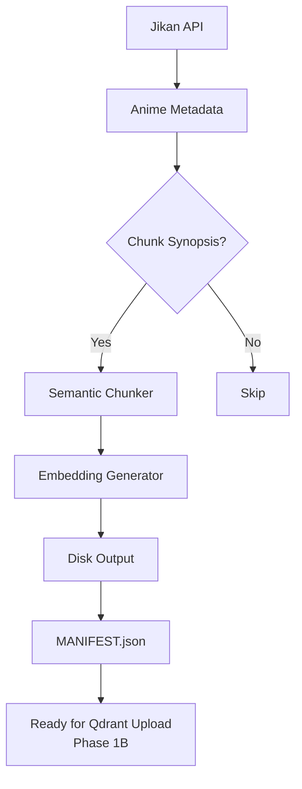

# ADR 002: Minimal Ingestion Pipeline Design

**Status**: Accepted  
**Date**: 2026-02-18  
**Decision Maker**: shankssc

## Context

Need a disk-based ingestion pipeline that:

- Works without infrastructure dependencies (Qdrant/Redis not required for initial validation)
- Processes real anime data from Jikan API
- Generates production-quality embeddings
- Outputs verifiable artifacts for testing downstream components

## Decision

Implement minimal vertical slice pipeline with these characteristics:

| Component         | Implementation                                            | Rationale                                          |
| ----------------- | --------------------------------------------------------- | -------------------------------------------------- |
| **Data Source**   | Jikan API (MyAnimeList) top anime                         | Free, reliable, rich metadata                      |
| **Chunking**      | Semantic sentence-aware chunker (512 chars w/ 50 overlap) | Preserves context better than fixed-size chunks    |
| **Embeddings**    | `all-MiniLM-L6-v2` (384-dim)                              | Fits Qdrant free tier; CPU-friendly on Render      |
| **Output Format** | JSON + NumPy (.npy)                                       | Human-readable metadata + efficient vector storage |
| **Validation**    | MANIFEST.json with timing/metrics                         | Enables reproducibility and pipeline monitoring    |

## Pipeline Flow

