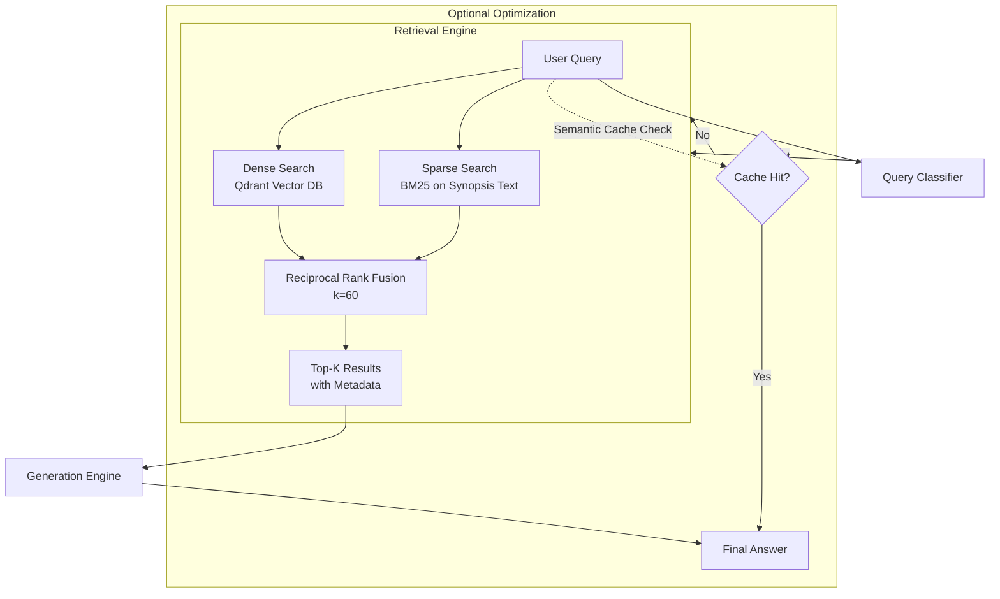

````markdown
# Retrieval Architecture: Hybrid Search Flow

## Overview

AniRAG implements a **hybrid retrieval architecture** combining dense vector search (semantic similarity) with sparse BM25 search (keyword matching). Results are fused using Reciprocal Rank Fusion (RRF) to leverage strengths of both approaches.


````
